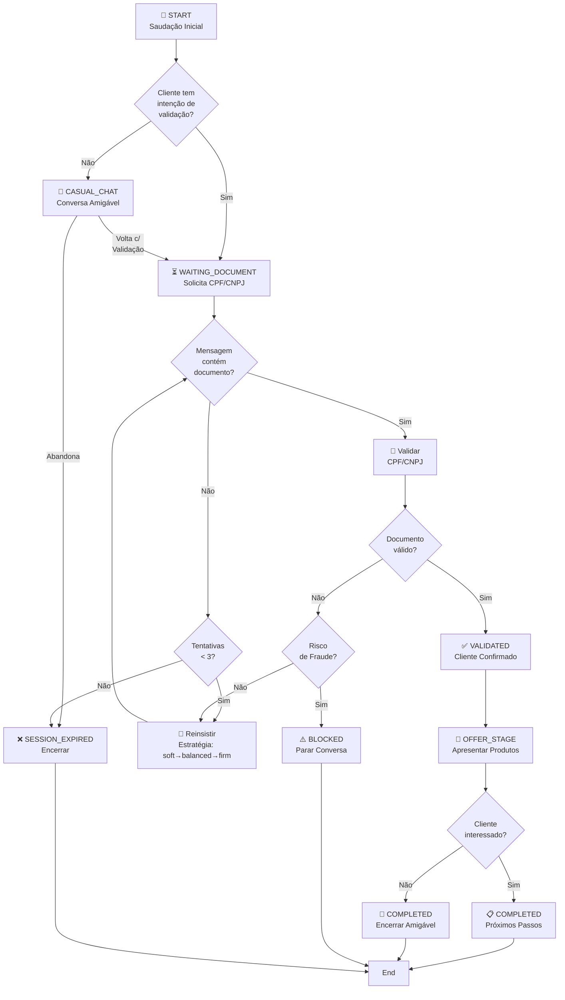

# Resumo Técnico - Mia WhatsApp Bot

## O Projeto

Sistema de validação de cliente AI-powered para o Banco Nova Era via WhatsApp. A **Mia** é uma IA de vendas que:

1. Interage com clientes em linguagem natural
2. Valida identidade via CPF/CNPJ antes de oferecer produtos
3. Detecta intenção do usuário e ajusta estratégia de resposta
4. Governa respostas para evitar violações de regras críticas

## Arquitetura em Camadas

```
┌─────────────────────────────────┐
│   WhatsApp Webhook (HTTP)       │ routes/whatsappWebhook.ts
├─────────────────────────────────┤
│   Message Classifier            │ services/messageClassifier.ts
│   (Intent + Emotion)            │
├─────────────────────────────────┤
│   Conversation Manager          │ state/conversationManager.ts
│   (State + Governance Rules)    │
├─────────────────────────────────┤
│   Response Validator            │ validators/responseValidator.ts
│   (Post-Processing)             │
├─────────────────────────────────┤
│   LLM Service (Claude/OpenAI)   │ services/llmService.ts
│   Template Service              │ services/templateService.ts
└─────────────────────────────────┘
```

## Componentes Principais

### Classificador de Mensagens
- **Arquivo:** `src/services/messageClassifier.ts`
- **Responsabilidade:** Extrair intenção e emoção do usuário
- **Intenções:** greeting, direct_validation_request, validation_resistance, casual_chat, scam_suspicion
- **Emoções:** neutral, playful, frustrated, aggressive

### Gerenciador de Conversa
- **Arquivo:** `src/state/conversationManager.ts`
- **Responsabilidade:** Manter contexto, aplicar regras de governança, definir estratégia de resposta
- **Estratégias:** soft, balanced, firm
- **Governança:** Validação de CPF/CNPJ, escalação de resistência, detecção de suspeita de fraude

### Validador de Resposta
- **Arquivo:** `src/validators/responseValidator.ts`
- **Responsabilidade:** Post-processar resposta do LLM
- **Regras:** Sem emoji durante validação, sem menção de DNA se sem intenção direta, sem aceleração de ritmo

### Serviço LLM
- **Arquivo:** `src/services/llmService.ts`
- **Responsabilidade:** Executar chamadas ao Claude/OpenAI com prompt governado e templates

## Fluxo de Uma Mensagem

1. **Receber:** Webhook WhatsApp recebe mensagem
2. **Classificar:** Extrair intenção + emoção
3. **Contexto:** Carregar/criar sessão do cliente
4. **Governar:** Aplicar regras de negócio
5. **LLM:** Gerar resposta com template + prompt
6. **Validar:** Verificar violações
7. **Enviar:** Retornar ao cliente

## Fluxo de Conversa Completo



**Estados da Máquina:**
- **START:** Mensagem inicial do bot
- **WAITING_DOCUMENT:** Aguardando entrada de CPF/CNPJ do cliente
- **VALIDATED:** Cliente passou na validação
- **OFFER_STAGE:** Apresentando produtos financeiros
- **COMPLETED:** Conversa finalizada
- **SESSION_EXPIRED:** Sessão expirou sem validação

**Estratégias Adaptativas:**
- **soft:** Cliente novo ou amigável → tom acolhedor
- **balanced:** Cliente neutro → tom profissional
- **firm:** Cliente resistente ou com suspeita de fraude → tom assertivo

## Stack Técnico

- **Runtime:** Node.js + TypeScript
- **Testes:** Jest (unit + integration)
- **LLM:** Claude 3.5 Sonnet
- **HTTP:** Express.js
- **Templates:** Handlebars

## Iniciando

```bash
npm install
npm run build
NODE_ENV=production npm start
```

Para testes:
```bash
npm test
```

## Maturidade

✅ Testes estruturados em `src/__tests__/`
✅ Camadas bem separadas com responsabilidades claras
✅ Governança de resposta implementada
✅ Type safety com TypeScript
